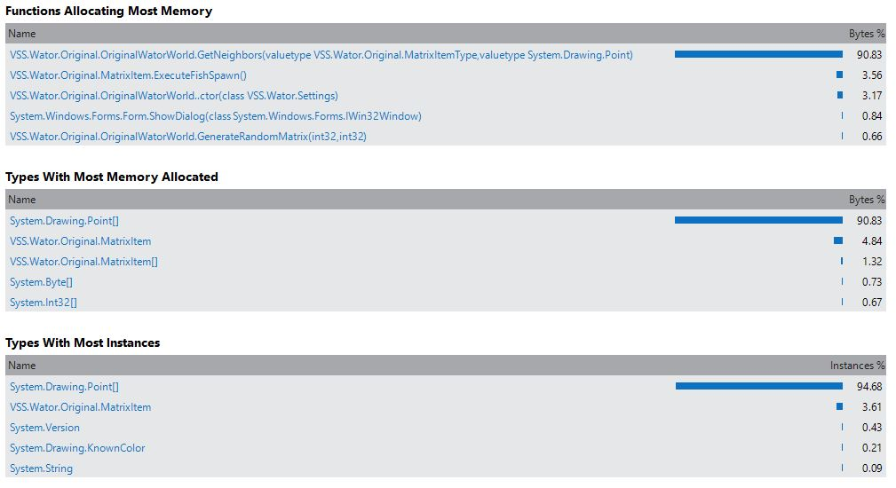

Waterwolrd Analysis
===================
Ing. Thomas Herzog <S1310307011@students.fh-hagenberg.at>
v1.0, March 31 2016

Folgendes Dokument beschäfftigst sich mit der Analyse und verbessurng des C# Programms 'Waterworld'. +
Im ersten Kapitel xref:runtime-analysis[Laufzeitanalyse] wird die Laufzeit mit mehreren Durchläufen mit einer bestimmten Konfiguration betrachtet.

[[runtime-analysis]]
### Laufzeit-Analyse
Folgendes Bild zeigt die festegestzte Konfiguration für die Testdurchläufe. + 

image::./images/test-settings.JPG[Testkonfiguration]
Mit dieser Konfiguration wurden *10* Durchläufe vorgenommen, deren ERgebnisse folgend tabelarisch aufgelistet sind.

.Ergebnisse der Testdurchläufe

image::./images/original_run_10_times.JPG[Testdurchläufe]

### 'Heap'-Analyse
Dieser Abschnitt beschäftigt sich mit der 'Heap'-Analyse, die aufzeigen wird, wie der Heap sich zur Programmlaufzeit verhält und welche Objekte am 'Heap' in welcher Verteilung vorzufinden sind. 

#### Originalversion
Folgender Teil zeigt die Analyseergebnisse der Originalversion.

Eklatant fällt hier auf, dass es sher viele *'Point'* Instanzen am Heap gibt, die sehr kurzlebig sind und daher den 'Grabage Collector' stark belasten.

#### Erste Optimierungen 
Folgender Teil zeigt die Analyseergebnisse nach dem ersten Optimierungsversuch.

//TODO: Add heap images here and tables with the objects represented on the heap with which count.

[[software-analysis]]
## Programmanalyse
hello

[[refactore-part-1]]# Umstrukturierung Teil 1||Std. Deviation|Run 1|Run 2
hello

[[refactore-part-2]]
## Umstrukturierung Teil 2
hello

[[refactore-part-3]]
## Umstrukturierung Teil 3
hello
