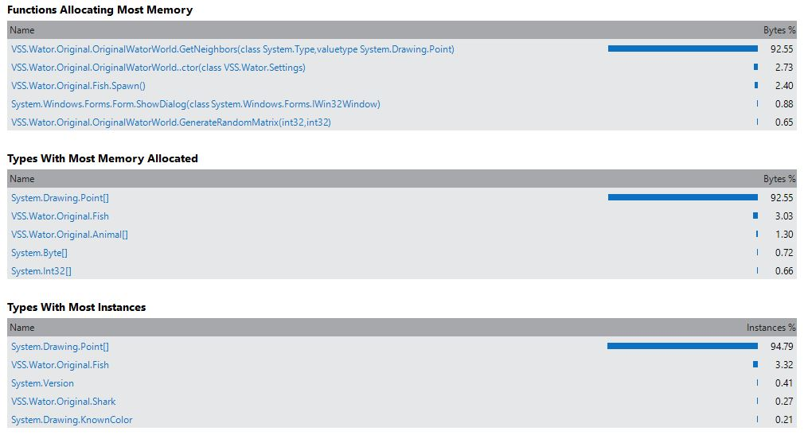
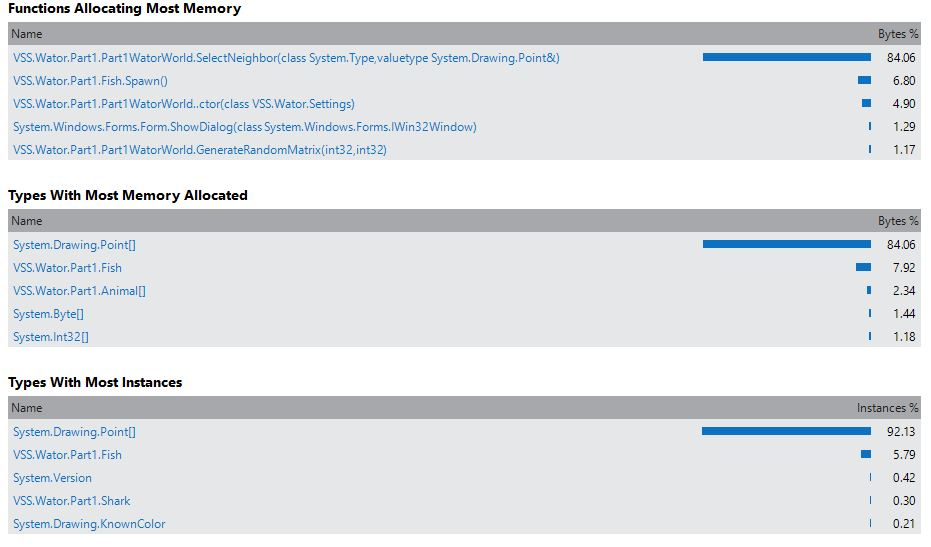
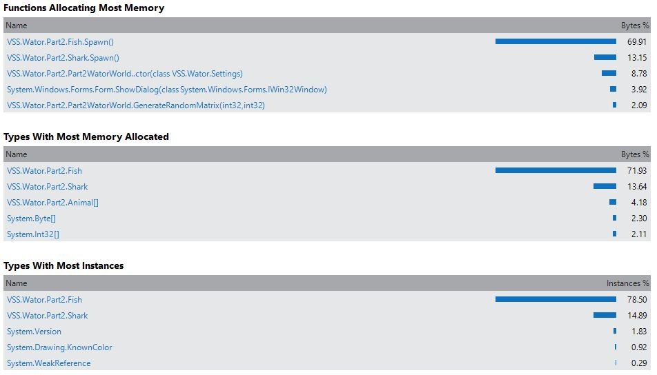
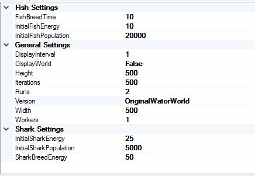
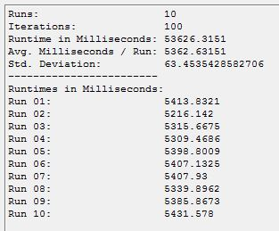
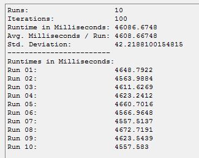
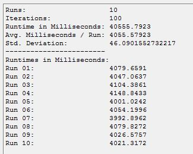
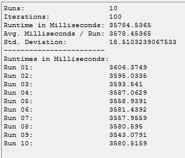

Waterwolrd Analysis
===================
Ing. Thomas Herzog <S1310307011@students.fh-hagenberg.at>
v1.0, March 31 2016

Folgendes Dokument beschäfftigt sich mit der Analyse und Verbessurng des 'C#' Programms 'Waterworld'. +

Die angewandten Verbesserungen wurden in der originalen 'Visual Studio Solution' bzw. den enthaltenen Projekt in folgender Verzeichnisstruktur organisiert:

[underline]**#Wator/Wator/#**

* 'Orginal'
* 'Part1' (Point Instanzen vermeiden)
* 'Part2' (SelectNeighbor entfernen)
* 'Part3' (GenerateRandomMatrix, RandomizeMatrix)

Alle Implementierungen von 'IWatorWorld' wurden in der Klasse 'Version' hinzugefügt und können über die Einstellungen des Programms 'WatorWorld' ausgewählt werden.

Im ersten Kapitel <<section-analysis-heap>> wird das Verhalten am 'Heap' der Originalversion zu den Verbesserungen betrachtet. +

Im Kapitel <<section-analysis-runtime>> wird das Laufzeitverhalten der Originalversion zu den Verbesserungen bettrachtet. +

Im Kapitel <<section-source-improvements>> werden die drei angewandten Verbesserungen beschrieben und begründet. +

[[section-analysis-heap]]
== 'Heap'-Analyse
Dieses Kapitel beschäftigt sich mit der 'Heap'-Analyse, die aufzeigen wird, wie sich der Heap zur Programmlaufzeit der verschiedenen Programmversionen verhält und welche Objekte am 'Heap' in welcher Verteilung und Häufigkeit vorzufinden sind. Diese Analyseergbenisse werden bei den Verbesserungen benötigt, da sie aufzeigen werden, wo in den verschiedenen Programmversionen Probleme am 'Heap' vorzufinden sind. +

Gleichzeigtig werden die Analyseergebnisse auch aufzeigen, inwiefern sich das Verhalten am 'Heap' durch die angewandten Verbesserungen verändert hat. 

[[subsection-analysis-heap-original]]
=== Ergebnisse: 'Originalversion'
Folgender Teil beschäftigt sich mit den Ergebnissen der 'Heap'-Analyse der Originalversion.

[[original-analysis-heap]]
.Verhalten am Heap der "Originalversion"

Eklatant fällt hier auf, dass es sehr viele 'Point'-Objekte am Heap gibt, die sehr kurzlebig sind und daher den 'Grabage Collector' stark belasten. Daher sollte hier angesetzt werden, um zu versuchen diese 'Point'-Objekte zu vermeiden. + 

Des Weiteren sieht man in Abbildung <<original-analysis-heap>>, dass die Methode `GetNeighbors(Type, Point)` die meisten 'Point'-Objekte produziert, daher sollte man hier zuerst ansetzen. In der Methode `GetNeighbors(Type, Point)` werden alle Nachbarn gesucht und die Methode `SelectNeighbor(Type, Point)` entscheidet per Zufall welcher Nachbar herangezogen wird. Dadurch das immer alle Nachbarn gesucht aber nur einer herangezogen wird, sind zu viele Zugriffe auf die Matrix erforderlich um die Nachbarn zu erhalten, was die Laufzeit negativ beeinflusst.

[[part-1-analysis-heap]]
=== Ergebnisse: 'Point Instanzen vermeiden'
Folgende Teil zeigt die Analyseergebnisse der 'Heap'-Analyse der Verbesserung 'Point Instanzen vermeiden'.

.Verhalten am Heap der Verbesserung "Point Instanzen vermeiden"

Diese Verbesserung hat erreicht das anstatt **'~ 94 %'** nur mehr **'~ 84 %'** der Objekte am 'Heap' 'Point'-Instanzen sind. Dadurch ist der 'Garbage Collector' weniger stark ausgelastet, was einen positiven Effekt auf das Laufzeitverhalten hat. +

Trotzdem sei angemerkt, dass sich herausgestellt hat, dass der Ansatz des 'Random'-Zugriff auf die 'Direction' beim Ermitteln der Nachbarn die Laufzeit um **'~ 500ms'** verschlechtert, daher wurde der Randomzugriff entfernt. Dadurch wird aber immer in die gleiche Richtung gegangen bzw nach Nachbanr gesucht, was zur Folge hat, dass dies auf der grafischen Asugabe sichtbar wird. 

<<<
[[part-2-analysis-heap]]
=== Ergebnisse: 'SelectNeighbor entfernen'
Folgender Teil zeigt die Analyseergebnisse der 'Heap'-Analyse der Verbesserung 'SelectNeighbor entfernen'.

.Verhalten am Heap der Verbesserung "SelectNeighbor entfernen"

Durch das Entfernen der Methode `SelectNeighbor(Type, Point)` sind die 'Point'-Objekte nicht mehr die dominanten Objekte am 'Heap', sondern die 'Fish'-Objekte, die aber nicht zu vermeiden sind, da es nur soviele Fische am 'Heap' gibt, als wie in der Matrix vorhanden. Und die 'Fish'-Objekte sind langlebige Objekte im Unterschied zu den 'Point'-Objekten. Diese Verbesserung hat also den 'Heap' entlastet.

<<<
[[section-analysis-runtime]]
== Laufzeit-Analyse
Dieses Kapitel beschäftigt sich mit der 'Runtime'-Analyse der Orginalversion zu den angewandten Verbesserungen. Dieses Kapitel wird aufzeigen wie sich das Laufzeitverhalten der verschiedene Programmversionen verhält und verändert. +

Folgendes Bild zeigt die festegestzte Konfiguration für alle gemachten Testdurchläufe. + 

.Konfiguration der Testdurchläufe

Mit dieser Konfiguration wurden **10** Durchläufe vorgenommen, deren Ergebnisse folgend als Screenshots bei den verschiedenen Programmversionen angefügt sind.

[[original-analysis-runtime]]
=== Ergebnisse: 'der Originalversion'
Folgende Teil zeigt die Analyseergebnisse der 'Runtime'-Analyse der 'Originalversion'.

.Laufzeitverhalten der "Originalversion"

[[part-1-analysis-runtime]]
=== Ergebnisse: 'Point Instanzen vermeiden'
Folgender Teil zeigt die Analyseergebnisse der 'Runtime'-Analyse der Verbesserung 'Point Instanzen vermeiden'.

.Laufzeitverhalten der "Point Instanzen vermeiden"

Mit dieser ersten Verbesserung wurde die Laufzeit der Anwendung um **'~ 0.7 sec'** verbessert.

[[part-2-analysis-runtime]]
=== Ergebnisse: 'SelectNeighbor entfernen'
Folgende Teil zeigt die Analyseergebnisse der 'Runtime'-Analyse dieser angewandten Verbesserung.

.Laufzeitverhalten: 'SelectNeighbor entfernen'
Folgender Teil zeigt die Analyseergebnisse der 'Runtime'-Analyse der Verbesserung 'SelectNeighbor entfernen'.

Mit dieser zweiten Verbesserung wurde die Laufzeit der Anwendung um **'~ 1.4 sec'** verbessert.

<<<
[[part-3-analysis-runtime]]
=== Ergebnisse von: 'GenerateRandomMatrix, RandomizeMatrix'
Folgende Teil zeigt die Analyseergebnisse der 'Runtime'-Analyse dieser angewandten Verbesserung.

.Ergebnisse von: GenerateMatrix, RandomizeMatrix modifizieren

Mit dieser letzten Verbesserung wurde die Laufzeit der Anwendung um *'~ 1.8 sec'* verbessert.

<<<
[[section-source-improvements]]
== Quelltextverbesserungen 
Folgender Teil beschäftigt sich mit den Optimierungen, die angewendet wurden, um das Laufzeitverhalten zu verbessern. Es wurden drei Verbesserungen angewandt die nachfolgend aufgeführt sind:

* <<subsection-source-improvements-part-1>>
* <<subsection-source-improvements-part-2>>
* <<subsection-source-improvements-part-3>>

[[subsection-source-improvements-part-1]]
=== Point Instanzen vermeiden
Die Methode `GetNeighbors(Type, Point)` wurde dahingehend werändert, dass nicht mehr alle Nachbarn besucht und zurückgeliefert werden, sondern dass per Zufall, solange die möglichen Nachbarn besucht werden, bis das erwartete Resultat eintritt. Der erste gefundene Nachbar, der die Anforderungen erfüllt, wird zurückgeliefert. +

Siehe hierzu die folgenden Methoden in 'Part1WatorWorld':

* `public Point GetNeighbors(Type type, Point position)`
* `public Point SelectNeighbor(Type type, Point position)`

In der Methode `SelectNeighbor(Type type, Point position)` wurde lediglich folgende Änderung vorgenommen + 
`Point[] neighbors = new Point[] { GetNeighbors(type, ref position) };`. Damit bleibt die restliche Implementierung von Änderungen unbettroffen.

Durch die Änderungen in `GetNeighbors(Type, Point)` wird das Verhalten teilweise verändert, da andere Wege als bei der Originalversion gegangen werden. Dies könnte als Änderung am Programm ausgelegt werden, wenn dieses Verhalten als essentiell eingestuft wird.

[[subsection-source-improvements-part-2]]
=== SelectNeighbor entfernen
Nachdem die Methode `GetNeighbors(Type, Point)` so verändert wurde, dass hbier bereits eine einzige Position eines Nachbarn zurückgelifert wird, kann auf die Methode 'SelectNeighbor' verzichtet werden, da die implementierte Logik keine Anwendung mehr findet. Im Zuge dessen wird die Methode `GetNeighbors(Type, Point)` unbenannt in `GetNeighbor(Type, Point)`, da diese Methode nur mehr ein Resultat und kein Array mehr zurückliefert. Dadurch wird ein 'Methoden'-Aufruf vermieden und das Durchschleifen bzw. Kopieren (bei 'Value Types') der Aktualparameter.

[[subsection-source-improvements-part-3]]
=== GenerateRandomMatrix, RandomizeMatrix
Anstatt ein zweidimensionales Array zu verwenden, in dem die Indixes abgebildet werden, wird eine Liste von 'Point'-Objekten beim erstamligen Erstellen der Matrix erstellt und bei jedem Aufruf der Methode `ExecuteStep()` zufällig neu geordnet. Es werden zwar alle Positionen auf der Matrix über 'Point'-Objekte abgebildet, aber diese 'Point'-Objekte bleiben über die Laufzeit erhalten und werden daher vom 'Garbage Collector' nicht beachtet, da immer eine Referenz auf diese Objekte besteht. Das zufällige Besuchen der Positionen bleibt gewährleistet. Des Weiteren werden alle 'Animal'-Objekte, die in der Methode `ExecuteStep()` als 'Moved' markiert wurden, in einer Liste gespeichert und nachdem alle Positionen besucht wurden, 'commited'. Dadurch wird ein weiteres Iterieren über alle Positionen vermieden.

Siehe dazu die folgenden Methoden in der Klasse 'Part3WatorWorld':

* `ExecuteStep()`
* `ShuffelPoints(Point[])` (Ersetzt RandomizeMatrix)
