Synchronization
===============
Ing. Thomas Herzog <S1310307011@students.fh-hagenberg.at>
v1.0, April 14 2016

Folgendes Dokument stellt die Dokumentation für die zweite Übung dar. Diese Übung ist in drei Teile unterteilt:

* <<section_race_conditions>>
* <<section_synchronization_primitives>>
* <<section_toilet_simulation>>

[[section_race_conditions]]
== Race conditions
Dieser Abschnitt beschäftigt sich mit 'Race conditions'. +
'Race conditions' tretten auf wenn mehrere 'Threads' gleichzeitig auf eine Variable zugreifen, die in einer nicht atomaren Operation verändert wird. Dadurch können inkonsistente Datenbestände entstehen, da der Wert der Variable gleichzeit von mehreren Threads gelesen und geschrieben wird. Ebenso können Schreiboperationen auf diese Variable verloren gehen, wenn dieser Wert durch einen anderen 'Thread' überschriben wird. Um 'race conditions' zu vermeiden, müssen die nicht atomarn Operationen ('critical sections'), die in einem 'Multithreading'-Kontext verwendet werden, synchronisiert werden und dadurch zu einer atomaren Operation zusammengeführt werden. +

Folgendes Visual Studio Projekt enthält alle Implementierungen *'RaceConditions'*.

=== Simple race condition
Folgender Beispielcode illustriert eine simple 'race condition'.

.Race condition example
[[listing-race-condition]]
[source, c#] 
----
private int value = 0;
private readonly Random random = new Random();

public void DoStuff()
{
    for (int j = 0; j < 100; j++)
    {
        int oldValue = value;
        // start: critical section
        int newValue = value = value + 1;
        // end: critical section

        if ((oldValue - newValue) != -1)
        {
            Console.WriteLine($"OldValue: {oldValue}, newValue: {value}");
        }
        
        // wait randomly 
        Thread.Sleep(random.Next(100));
    }
}
----

.Synchronized example
[[listing-race-condition-solution]]
[source, c#] 
----
private int value = 0;
private readonly Random random = new Random();

private readonly object mutext = new object();

public void DoStuff()
{
    for (int j = 0; j < 100; j++)
    {
        int oldValue, newValue;
        
        // oldValue = value;
        // start: critical section
        // newValue = value = value + 1;
        // end: critical section

        // start: synchronization
        lock(mutex){
            oldValue = value;
            newValue = value = value + 1;
        }
        // end: synchronization
        
        if ((oldValue - newValue) != -1)
        {
            Console.WriteLine($"OldValue: {oldValue}, newValue: {value}");
        }
        
        // wait randomly 
        Thread.Sleep(random.Next(100));
    }
}
----

<<<
==== Simple race condition Test
Folgender Abschnitt beschäftigt sich mit den Tests der implementierten 'race condition'. +
Es wurden zwei Tests durchgeführt, wobei je ein Test  
 
* synchronisiert
* und nicht synchronisiert

durchgeführt wurde. Dieser Test illustriert wie in ein einem nicht snychronisierten Kontext 'race conditions' auftretten können. +
Es wurde folgende Konfiguration für den Test festgelegt: 20 'Threads' mit 100 Iteration / 'Thread'

image::./images/simple_race_condition_test.JPG[Simple 'race condition' synchrnous]
Nachdem nicht vorhergesagt werden kann zu welchem Zeitpunkt welcher Thread die Variable manipuliert, sind diese Art von Tests auch nit deterministisch und können daher auch nicht reproduziert werden. Es kann also vorkommen, dass bei Testdurchläufen keine 'race condition' auftritt. +

Für das implementierte Beispiel siehe bitte 'Source' link:../hands-on-2-solution/RaceConditions/SimpleRacecondition.cs[SimpleRacecondition.cs].

=== Fix race condition
Folgender Abschnitt beschäftigt sich mit dem Fix für das 'Code'-Beispiel einer 'race condition'. + 
Die 'race condition' tritt beim indexierten Zugriff auf den Buffer auf, da hier gleichzeitig von 'Threads' gelesen und geschrieben wird und der Buffer über alle 'Threads' geteilt wird. +

Dieses Problem lässt sich durch die Synchronisation des lesenden und schreibenden Zugriffs auf den Buffer lösen. Zusätzlich wurden Änderungen vorgenommen, die ein blockieren dieses Beispiels verhindern. (Blockierte in der Originalversion) +

Für die implementierten Fixes siehe 'Source' link:../hands-on-2-solution/RaceConditions/RaceConditionExampleFixed.cs[RaceConditionExampleFixed.cs]

[[section_synchronization_primitives]]
== Synchronization primitves
Dieser Abschnitt beschäftigt sich mit der Aufgabe 'Synchrnoization primitives'. +
Die Aufgabe der *parallen 'Doownloads'* von Dateien, wurde mit Hilfe von einer Semaphore gelöst, die maximal 10 'Threads' parallel zulässt. Die Threads erhalten eine Referenz auf die Semaphore und fragen diese am Beginn der Methode an. Steht die 'Semaphore' zur Verfügung, wird die Methode abgearbeitet und wenn nicht, wird an diese Stelle blockiert. Die 'Threads' werden sofort nach ihrer Erzeugung gestartet und werden in der synchronen Version gejoined und in der asynchronen Version nicht. +

Für weitere Details und die anderen Aufgaben sei auf den 'Source', die 'Tests' und die 'Source'-Dokumentation im Projekt *'SynchrnoizationPrimitives'* verwießen.

[[section_toilet_simulation]]
== ToiletSimulation
Folgender Abschnitt beschäftigt sich mit der Aufgabe 'ToiletSimulation'. +

Folgendes Visual Studio Projekt enthält alle Implementierungen *'SynchronizationPrimitives'*.

=== FIFOQeuue
Folgender Abschnitt beschäftigt sich mit dem ersten Teil der Aufgabe 'ToiletSimulation', in der eine 'FIFOQueue' implementiert werden musste. +

Die 'FIFOQueue' verwendet zwei 'Semaphoren' wobei

* eine 'Semaphore' für die 'Producer'
* und eine 'Semaphore' für die 'Consumer'

verwendet wird. Die 'Semaphoren' synchronisieren einerseits die 'Producer' sowie die 'Consumer'. Für die Implementierungsdetails sei auf die Klasse link:../hands-on-2-solution/ToiletSimulationForStudents/FIFOQueue.cs[FIFOQueue.cs] verwießen.

=== ToiletQueue
Folgender Abschnitt beschäftigt sich mit der implementierten 'ToiletQueue', die eine Verbesserung der implementierten 'FIFOQueue' darstellen soll. Dazu wurden mehrere Synchronizationsmöglichkeiten implementiert wie

* mit 'Semaphore',
* mit 'AutoResetEvent',
* mit 'Thread.Sleep',
* und mit 'Thread.SpinWait',

die auf mehrere 'Container' wie

* List
* und PriorityQueue

andwendbar ist. Der zu verwendene 'Container' und die Synchrnizationsart kann über den Konstruktor definiert werden. Für weitere Implementierungsdetails sei auf den 'Source'  link:../hands-on-2-solution/ToiletSimulationForStudents/ToiletQueue.cs[ToiletQueue.cs].

==== NetFIFOQueue Tests
Folgender Abschnitt beschäftig tsich mit den Tests der 'NetFIFOQueue'. Diese 'Queue-'Implementierung delegiert an die 'C# BlockingQueue', welche die 'C#' Implementierung einer 'FIFOQueue' darstellt.

.'NetFIFOQueue'
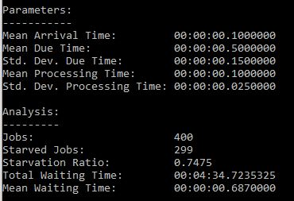

==== FIFOQueue Tests
Folgender Abschnitt beschäftig tsich mit den Tests der 'FIFOQueue'. Diese Klasse representiert die eigens implementierte 'FIFOQueue'.

.'FIFOQueue' with List
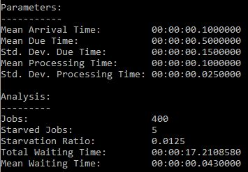

.'FIFOQueue with PriorityQueue'
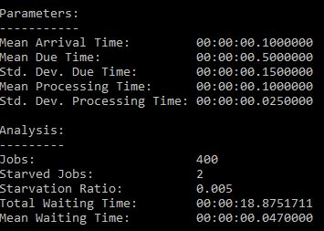 

==== ToiletQueue Tests
Folgender Abschnitt beschäftig tsich mit den Tests der 'ToiletQueue'. Diese Klasse representiert die eigens implementierte 'Queue', die eine Verbesserung der implementierten 'FIFOQueue' sein soll.

.'ToiletQueue with List and Semaphore'
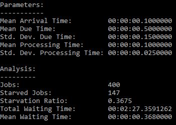

.'ToiletQueue with List and AutoResetEvent'
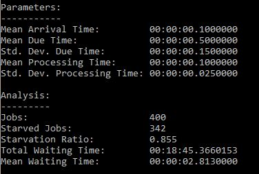 

.'ToiletQueue with List and Thread.Sleep' 
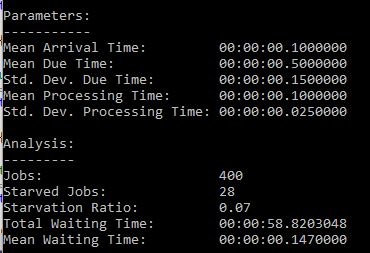 

.'ToiletQueue with List and Thread.SpinWait'
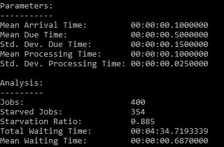 

.'ToiletQueue with PriorityQueue and Semaphore'
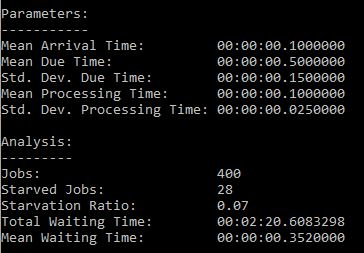 

.'ToiletQueue with PriorityQueue and AutoResetEvent'
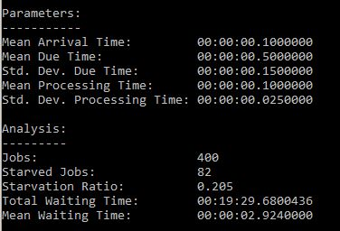 

.'ToiletQueue with PriorityQueue and Thread.Sleep' 
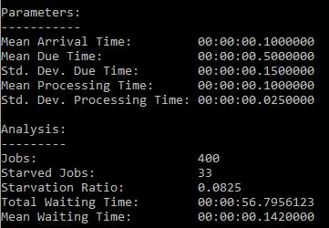 

.'ToiletQueue with PriorityQueue and Thread.SpinWait'
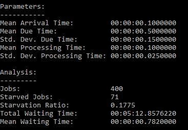 

Es hat sich gezeigt, dass die Implementierung der 'FIFOQueue' mit der Implementierung der 'ToiletQueue' nicht verbessert werden konnte.
