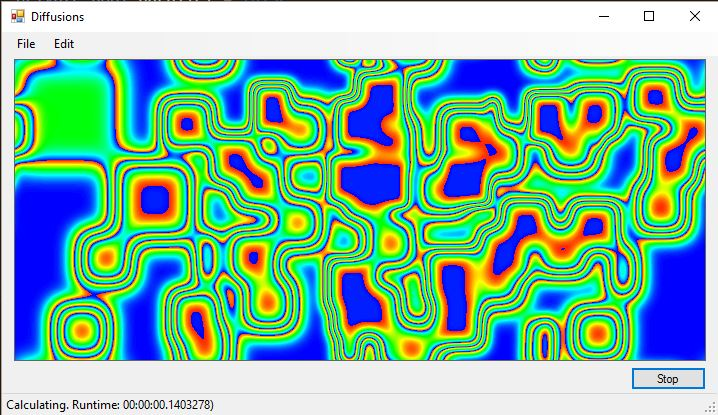

Diffusions and Stock Data
=========================
Ing. Thomas Herzog <S1310307011@students.fh-hagenberg.at>
v1.0, May 15 2016

Folgende Dokumentation behandelt die beiden Aufgaben 

* <<section-diffusions>>
* <<section-stock-data>>

Wobei jeweils eine synchrone und eine parallel Version entwickelt werden musste.

[[section-diffusions]]
=== Diffusions
Folgender Teil der Dokumentation behandelt die Aufgabestellung *Diffusions*. +
Dabei ist dieser Teil der Dokumentation in folgende Abschnitte unterteilt:

* <<section-diffusions-sequientiel>> 
* <<section-diffusions-parallel>>

Diese Abschnitte behandeln die jeweils unterschiedlichen Implementierungsschritte. 

<<<
[[section-diffusions-sequientiel]]
==== Sequientielle Implementierung
Da gemeinsame Implementierungsdetails erkannt wurden, wurden diese in die Basisklasse *Image* ausgelagert, da diese von der synchronen und parallelen Version gemeinsam genutzt werden können. +

:source-highlighter: pygments
[source, c#] 
.Snychrone Generierung des Images
----
public override Bitmap GenerateBitmap(Area area)
{
    var matrix = area.Matrix;
    int height = area.Height;
    int width = area.Width;

    var newMatrix = new double[width, height];

    for (var i = 0; i < width; i++)
    {
        for (var j = 0; j < height; j++)
        {
            // Calculate the matrix
            CalculateMatrix(i, j, height, width, matrix, newMatrix);

            // break inner loop
            if (stopRequested) { break; }
        }
        // break outer loop
        if (stopRequested) { break; }
    }

    // null because image could be broken
    if (stopRequested) { return null; }

    // If stop request occurs here, let finish the image generation
    area.Matrix = newMatrix;
    Bitmap image = new Bitmap(width, height);
    ColorBitmap(newMatrix, width, height, image);

    return image;
}
----
Es wird nach Beendigung eines jeden Schleifendurchlaufs geprüft ob abgebrochen werden soll. Sollte dies der Fall sein, so wird als Resultat *null* zurückgeliefert. Ansonsten wird das Einfärben des generierten 'Images' noch durchgeführt, auch wenn außerhalb der Schleife ein 'StopRequest' erfolgt ist. 

:source-highlighter: pygments
[source, c#]
.Parallel Reheat
----
private void Reheat(double[,] matrix, int x, int y, int width, int height, int size, double val)
{
    lock(mutext) {
        for (int i = 0; i < size; i++)
        {
            for (int j = 0; j < size; j++)
            {
                matrix[(x + i) % width, (y + j) % height] = val;
            }
        }
    }
}
----
Die Methode 'Reheat' wurde iterativ implementiert. Die Iterationen erfolgen in einem 'Lock'-Kontext, da die aktuelle Matrix nicht ersetzt werden darf bevor Reheat fertig ist.

:source-highlighter: pygments
[source, c#]
.Start/Stop Methoden 
----
private void startButton_Click(object sender, EventArgs e)
{
    if (running)
    {
        running = false;
        generator.Stop();
    }
    else
    {
        running = true;
        InitArea();
        UpdateImage(currentArea);
    }
}
public virtual void Stop()
{
    stopRequested = true;
}
----
Die Implementierung des Start/Stop 'Buttons' ruft 'generator.Stop()' auf, die wiederum das 'Stop-Flag' setzt.

<<<
[[section-diffusions-parallel]]
==== Parallele Implementierung
Die parallele Implementierung unterscheidet sich nicht wesentlich von der synchronen Implementierung. Es wurden nur die 'For'-Schleifen durch 'Parallel.For' ersetzt, wobei diese Funktionalitäten aus der, von C# zur Verfügung gestellten 'Task-Parallel-Library' (TPL) stammen. +

:source-highlighter: pygments
[source, c#] 
.Parallel GenerateBitmap
----
public override Bitmap GenerateBitmap(Area area)
{
    var matrix = area.Matrix;
    int height = area.Height;
    int width = area.Width;

    var newMatrix = new double[width, height];

    cts = new CancellationTokenSource();
    ParallelOptions outerOptions = new ParallelOptions()
    {
        CancellationToken = cts.Token,
        MaxDegreeOfParallelism = MainForm.MAX_PARALLEL_OUTER
    };
    ParallelOptions innerOptions = new ParallelOptions()
    {
        CancellationToken = cts.Token,
        MaxDegreeOfParallelism = MainForm.MAX_PARALLEL_INNER
    };

    try
    {
        Parallel.For(0, width, outerOptions, (i, outerState) =>
        {
            try
            {
                Parallel.For(0, height, innerOptions, (j, innerState) =>
                {
                    try
                    {
                        // Calculate the matrix
                        CalculateMatrix(i, j, height, width, matrix, newMatrix);
                    }
                    catch (OperationCanceledException) { /* Nothing to do */ }
                });
            }
            catch (OperationCanceledException) {  /* Nothing to do */ }
        });
    }
    catch (OperationCanceledException) { /* Nothing to do */ }

    cts = null;

    // null because image could be broken
    if (stopRequested) return null;

    // if stop request occurs here, then we let finish the image generation
    area.Matrix = newMatrix;
    Bitmap image = new Bitmap(width, height);
    ColorBitmap(newMatrix, width, height, image);


    return image;
}
----
Der Abbruch der Schleifendurchläufe wird über eine 'CancelationTokenSource' erreicht, dessen 'CancelationToken' über ein 'ParallelOptions' Object an 'Parallel.For' übergeben wird. Bei einem Cancel wird die Abbarbeitung der Schleife mit einer 'OperationCanceldException' abgebrochen, die in jedem Schleifendurchlauf abgefangen wird. Des Weitern wurden die maximale Paralellisierung auf folgendes eingestellt:

* Äußere Schleife: *10*
* Innere Schleife: *2*

:source-highlighter: pygments
[source, c#]
.Parallel Reheat
----
private void ReheatParallel(double[,] matrix, int x, int y, int width, int height, int size, double val)
{
    lock(mutext) {
        Parallel.For(0, size, (i) =>
        {
            Parallel.For(0, size, (j) =>
                {
                    matrix[(x + i) % width, (y + j) % height] = val;
                });
        });
    }
}
----
Bei der parallelen Version wurde auch 'Reheat' parallelisiert und mit denselben Methoden wie 'GenerateImage' parallelisiert. Hier wird ein abbrechen nicht unterstützt.Die parallelen Iterationen erfolgen in einem 'Lock'-Kontext, da die aktuelle Matrix nicht ersetzt werden darf bevor Reheat fertig ist.

:source-highlighter: pygments
[source, c#]
.Start/Stop Methoden 
----
public override void Stop()
{
    stopRequested = true;
    cts?.Cancel();
}
----
Die Implementierung des Start/Stop 'Buttons' ruft ```generator.Stop()``` auf, die wiederum das 'Stop-Flag' setzt.

.Diffusions in Action


<<<
[[section-stock-data]]
=== Stock Data Visualization
Folgender Teil der Dokumentation behandelt die Aufgabe 'Stock-Data-Virsualization'.

:source-highlighter: pygments
[source, c#]
----
private void displayButton_Click_parallel(object sender, EventArgs e)
{
    Task.Run(() => ParallelImplementation());
}
public void OnDataLoaded(object sender, IList<Series> allSerieses)
{
    // If invoke is required, because here we could be on another thread
    if (InvokeRequired)
    {
        Invoke(new EventHandler<List<Series>>(OnDataLoaded), sender, allSerieses);
    }
    // if on the same thread
    else
    {
        DisplayData(allSerieses);
        SaveImage("chart");
    }
}
private void ParallelImplementation()
{
    // list which holds all runnint main tasks
    IList<Task<IList<Series>>> mainTasks = new List<Task<IList<Series>>>(names.Length);
    foreach (var name in names)
    {
        // preserve name
        var copiedName = name;
        // create main task
        var task = Task.Run(() =>
        {
            IList<Series> seriesList = new List<Series>();
            var data = RetrieveStockData(copiedName);
            
            // run inner tasks
            var seriesTask = Task.Run(() => GetSeries(data.GetValues(), copiedName));
            var trendTask = Task.Run(() => GetTrend(data.GetValues(), copiedName));

            // wait for all inner tasks
            Task.WaitAll(seriesTask, trendTask);

            // collect data of inner tasks
            seriesList.Add(seriesTask.Result);
            seriesList.Add(trendTask.Result);

            // return result of main taks
            return seriesList;
        });

        // remember main task
        mainTasks.Add(task);
    }

    // wait for all main tasks
    var result = Task.WhenAll(mainTasks.ToArray());

    // fire event for UI
    DataLoaded?.Invoke(this, MergeResults(result.Result));
}
----
Die Methode 'displayButton_Click_parallel' dient als Einstiegspunkt für die asynchrone Abbarbeitung des Downloads.
Der 'Button'-Klick blockiert daher nicht und das Resultat wir in einem 'Event-Handler' verarbeitet, der wiederum die Visualisierung erstellt.

:source-highlighter: pygments
[source, c#]
----
private async void displayButton_Click_async(object sender, EventArgs e)
{
    DisplayData(MergeResults(await ParallelImplementationAsync()));
    SaveImage("chart");
}
private async Task<IList<Series>[]> ParallelImplementationAsync()
{
    // list which holds all runnint main tasks
    IList<Task<List<Series>>> mainTasks = new List<Task<List<Series>>>(names.Length);

    foreach (var name in names)
    {
        var task = LoadAsync(name);

        // remember main task
        mainTasks.Add(task);
    }

    // wait for all main tasks
    return await Task.WhenAll(mainTasks.ToArray());
}
private async Task<List<Series>> LoadAsync(String name)
{
    return await Task.Run(async () =>
    {
        var seriesList = new List<Series>();
        var data = await RetrieveStockDataAsync(name);

        // run inner tasks
        var seriesTask = GetSeriesAsync(data.GetValues(), name);
        var trendTask = GetTrendAsync(data.GetValues(), name);

        // wait for all inner tasks
        var result = await Task.WhenAll(seriesTask, trendTask);

        // collect data of inner tasks
        seriesList.Add(result[0]);
        seriesList.Add(result[1]);

        // return result of main taks
        return seriesList;
    });
}
private async Task<StockData> RetrieveStockDataAsync(string name)
{
    return await Task.Run(() => service.GetData(name));
}
private async Task<Series> GetSeriesAsync(List<StockValue> stockValues, string name)
{
    return await Task.Run(() => GetSeries(stockValues, name));
}
private async Task<Series> GetTrendAsync(List<StockValue> stockValues, string name)
{
    return await Task.Run(() => GetTrend(stockValues, name));
}
----
Die Methode 'displayButton_Click_async' startet die asynchrone Methode 'ParallelImplementationAsync' und erwartet dessen Resultat mit dem 'await' Keyword, wobei hier der 'UI-Thred' nicht geblockt wird. Es wurden die existierenden Methoden für das Laden der Daten mit einer asynchronen Implementierung überladen, die mit 'async' deklariert sind.
